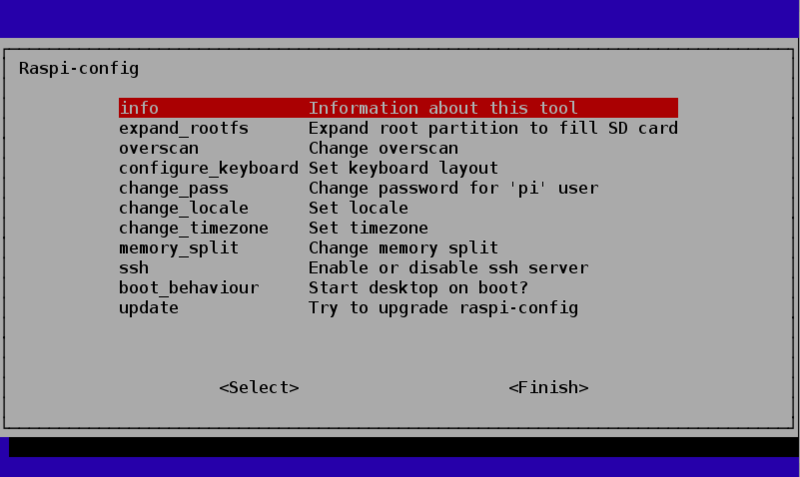
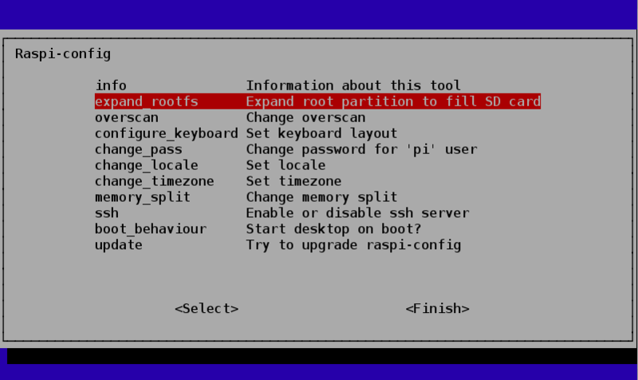
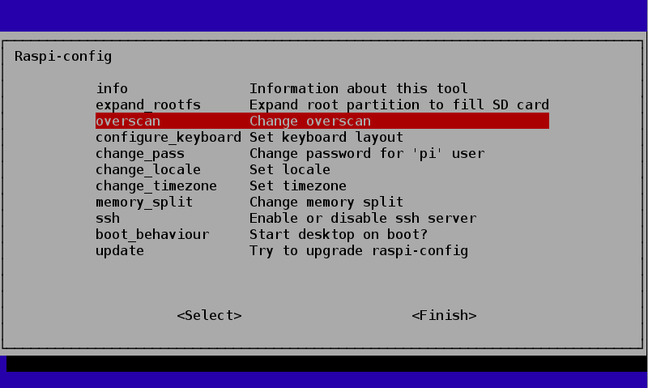
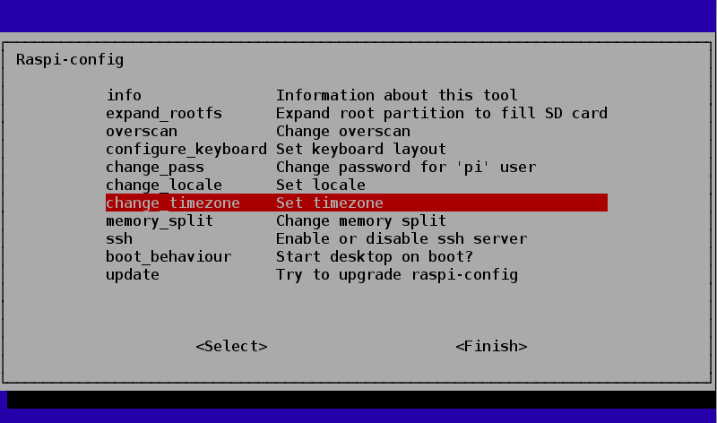
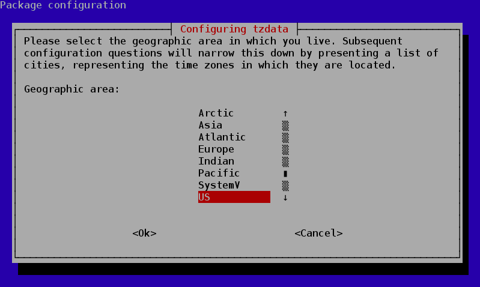
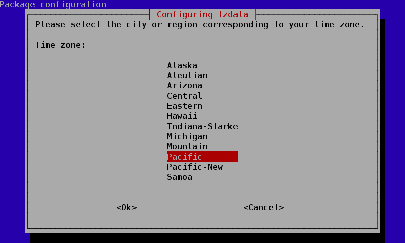
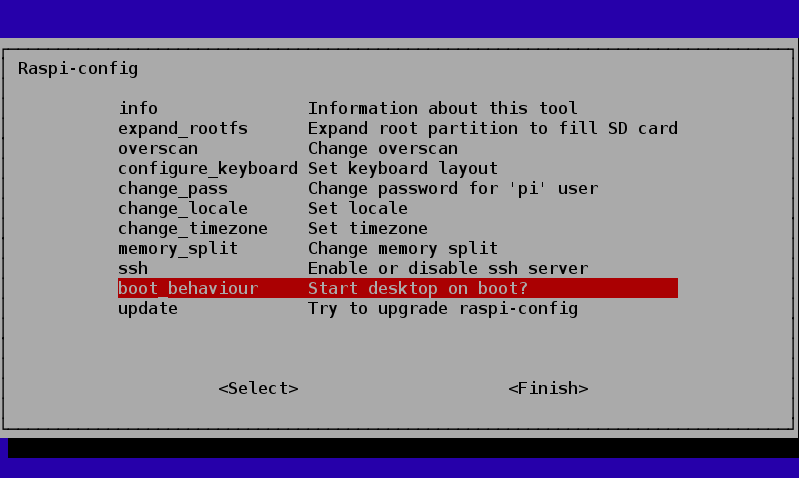
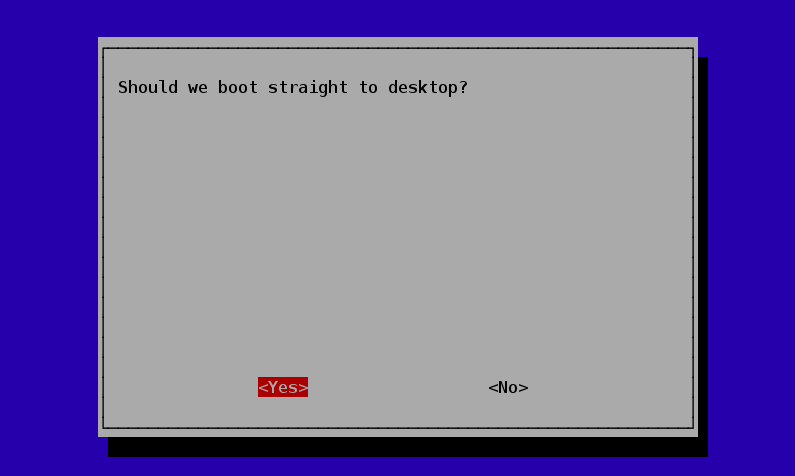

# Configuración del Sistema Operativo

Este tutorial explicará como configurar su Raspberry Pi por primera vez, luego de haber instalado el sistema operativo en la tarjeta SD.

Para ello, utilizaremos una herramienta llamada Raspi-Config que se ejecuta de manera automática la primera vez que inicializa su Pi. 

Para comenzar, empezaremos con las características más importantes, y luego miraremos otros detalles que podrían querer configurar.

## Tarjeta SD

Por defecto, su Pi sólo utilizará el espacio en la tarjeta SD que el sistema operativo instalado requiera, así que es posible que si tiene una tarjeta SD de gran capacidad, el sistema operativo desaprobeche una gran porción. Para evitar esto, seleccione la opción de menú `expand_roofts` y presione ENTER

Luego de esto, verá una pantalla de confirmación. Presione ENTER nuevamente para regresar al menú principal.

## Pantalla

Puesto que fue hecho para funcionar con televisores, es posible que su Pi sólo use una parte de la pantalla, dejando la mayor parte sin utilizar. Si es éste su caso, seleccione la opción `Disable Overscan`para solucionar este problema.

## Zona Horaria

Primero, sleccione el área geográfica, y luego la zona horaria dentro de esa área.

## Iniciar el Escritorio

Raspberyy Pi, por defecto, no inicia con una interfaz gráfica de ventanas, tan sólo muestra una terminal donde puede ingresar y escribir comandos de texto.

La siguiente configuración le permitirá iniciar en un sistema de ventanas la próxima vez que inicialice su Raspberry Pi.

En el menú principal, escoja la opción `boot behavior` y cambie la configuración a sì.

