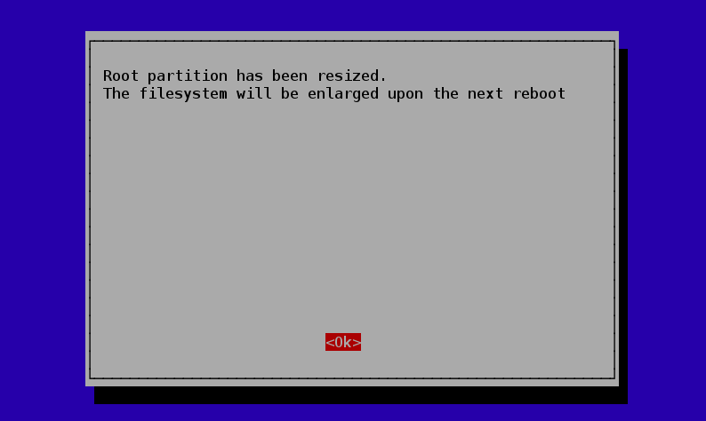

# Configuración del Sistema Operativo

Este tutorial explicará como configurar su Raspberry Pi por primera vez, luego de haber instalado el sistema operativo en la tarjeta SD.

Para ello, utilizaremos una herramienta llamada Raspi-Config que se ejecuta de manera automática la primera vez que inicializa su Pi. 

Para comenzar, empezaremos con las características más importantes, y luego miraremos otros detalles que podrían querer configurar.

## Tarjeta SD

Por defecto, su Pi sólo utilizará el espacio en la tarjeta SD que el sistema operativo instalado requiera, así que es posible que si tiene una tarjeta SD de gran capacidad, el sistema operativo desaprobeche una gran porción. Para evitar esto, seleccione la opción de menú `expand_roofts` y presione ENTER

Luego de esto, verá una pantalla de confirmación. Presione ENTER nuevamente para regresar al menú principal.

