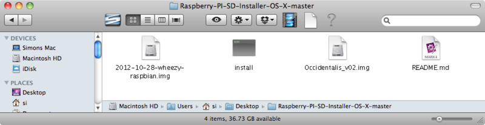
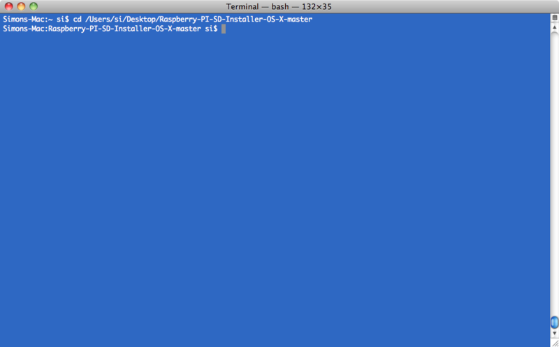
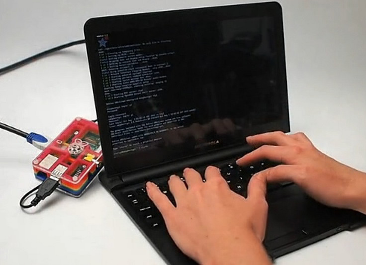

# Set-Up de una SD Card para el Raspberry Pi

Al comprar un Raspberry Pi, éste puede incluir una tarjeta SD. Ésta es muy importante, pues es en ella donde Raspberry Pi guarda su sistema operativo, así como donde usted guardará sus documentos y programas.

Inclusive si al comprar su Pi, éste incluía una tarjeta SD con el sistema operativo en ella, es recomendable actualizarlo a la última versión, pues mejoras y eliminación de bugs son constantemente agregadas. Debido a que al instalar el sistema operativo en la tarjeta SD borra todo lo demás en ella, guardar los documentos es una memoria USB es una buena opción a considerar, así no necesitará buscar dónde copiarlos mientras re-formatea la tarjeta SD cada vez que desee actualizar el sistema operativo.

Si al comprar su Pi, éste no incluía una tarjeta SD, es recomendable que al comprar una, sea mínimo de 4GB.

El siguiente tutorial le explicará cómo preparar una tarjeta SD para su Raspberry Pi utilizando desde un Mac. 

## PASO 1:
## Descargar el Archivo de Imagen

El sistema operativo que instalará en la tarjeta SD debe ser descargado de Internet. Por lo general, se tratará de un archivo zis que luego se extraerá en un archivo de imagen .img . Sin importar que archivo de imagen descargue, el proceso de instalación es el mismo.

Hay un número gigantesco de sistemas operativos que puede instalar en su Raspberry Pi, sin embargo, recomendamos a usuarios principiantes instalar únicamente una de las distribuciones Linux. El siguiente paso es decidir cual de todas las distribuciones de Linux, conocidas como "distro", quiere instalar. Al ser un sistema operativo abierto, cualquier persona puede coger distribuciones existentes de Linux y agregar o modificar elementos para conseguir una configuración específica. De esta forma se fue creando la configuración más popular para Raspberry Pi, conocida como "Raspbian". La distribución "Debian" fue configurada utilizando elementos muy útiles como IDLE (un entorno de desarrollo integrado para el lenguaje de programación Phyton) y Scracth ( un sistema de juego para aprender a programar), con el fin de adecuarla para el Pi. La gran mayoría de Raspberry Pi están configuradas de esta forma. Puede conseguir esta configuración en  http://www.raspberrypi.org/downloads

Para las personas que deseen una configuración que les permite mayor soporte de hardware, existe una versión de Raspbian hecha por Adafruit, llamada "Occidentalis". Esta es ideal para personas que deseen conectar sensores, LEDs, motores, e interruptores a su Pi. Puede conseguir esta versión en  http://learn.adafruit.com/adafruit-raspberry-pi-educational-linux-distro/

Ambas versiones son actualizadas periódicamente, y compartirán muchas características.

## PASO 2:
## Intalación desde un Mac

Una vez decidido cual instalar, descargue el archivo de imagen y péguelo en su Escritorio. En caso de estar en un zip, extraiga el archivo en el Escritorio.

Raj Vijoen creó un script que facilita mucho la instalación de la tarjeta SD desde un Mac. 

Descargue el Raspberry-Pi-SD-Installer-OS-X de https://github.com/RayViljoen/Raspberry-PI-SD-Installer-OS-X

Busque el botón de "zip" y descárguelo como archivo sencillo zip.

Extraiga el archivo zip. Éste creará una carpeta llamada "Raspberry-PI-SD-Installer-OS-X-master"

Utilice el Finder de su Mac para mover el archivo .img que descargo anteriormente a la la carpeta Raspberry-PI-SD-Installer-OS-X-master. Si lo desea, puede guardar los dos archivos dentro de la carpeta (Raspbian y Occidentalis). 

Abra la aplicación Terminal en su Mac. La encontrará en el Finder > Aplicaciones > Utilidades.

Escriba el comando 'cd', seguido de la ruta de su carpeta Raspberry-PI-SD-Installer-OS-X-master

En caso de tener conectadas unidades externas en su computador, asegúrese de extraerlas, esto facilitará identificar la unidad que corresponde a su tarjeta SD.

Inserte la tarjeta SD en su computador. Recuerde que toda la información que tenga actualmente en ella será borrada.

Ejecute el instalador de Pi escribiendo el siguiente comando en la Terminal:

>sudo./install Occidentalis_v02.img

'Occidentalir_v02.img' es el nombre del archivo .img que corresponde a la distribución que desea instalar.

Se le pedirá que ingrese la clave de su computador, y luego verá la siguiente pantalla:en el paso anterior, en este ejemplo `192.168.2.5` es la IP de mi Pi.

Su tarjeta SD ahora está lista para ser utilizada con su Raspberry Pi

## PASO 3:
## Configuración y Pruebas

Luego de haber instalado el sistema operativo en la tarjeta SD, querrá probar el resultado. Hacer esto es sencillo.

Inserte la tarjeta SD en su Raspberry Pi, luego conecte un teclado al puerto USB de su Pi, y una pantalla NTSC/PAL al puerto compuesto, o un monitor HDMI al puerto HDMI dentro de su Raspberry Pi. Luego, encienda su Pi conectando un cable Micro USB al Pi y alimentarlo con un computador o un cargador de pared con puerto USB.

En la pantalla, debería ver algo como esto; el logo de Adafruit/Raspberry en la parte superior izquierda, y lineas de texto que llenan la pantalla.

