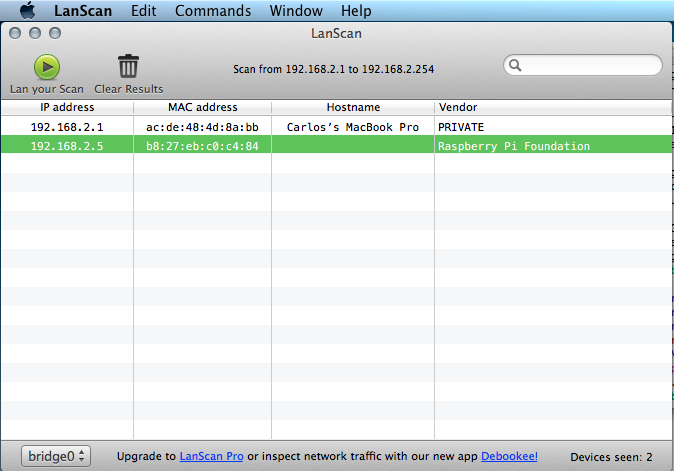

# Controlando el Pi desde otro computador via SSH

## OSX
Para los usuarios de OSX que no tienen mucho conocimiento de la terminal les recomiendo preferiblemente un programa que se llama LanScan (gratis) y lo pueden descargar directamente desde el Apple Store. 

Lo abren y en la parte superior izquierda del programa hay un boton de play, le dan click, y van a ver que les aparece una lista de direcciones IP, la primera es la de su computador, la segunda es la del PI. La copiamos que en el siguiente paso la vamos a utilizar.

Si lo quieren hacer desde la terminal, al tener su Pi conectado por el puerto ethernet, escribir el comando `sudo ifconfig` 

La IP que puede ver es la del Pi por lo tanto la copiamos para utilizarla en el siguiente paso

### Entrando al Raspberry por SSH

Una vez sabiendo la IP del Pi, procedemos a abrir la terminal. En ella vamos a usar el secure shell o SSH para entrar a nuestro Pi. Introducimos el siguiente comando `ssh pi@192.168.2.5`. Es aca en donde se debe poner la IP que buscaron en el paso anterior, en este ejemplo `192.168.2.5` es la IP de mi Pi.

## Linux

Pronto . . .
## Windows
Pronto . . .

## Licence

Unless otherwise specified, everything in this repository is covered by the following licence:

***Web Server Setup and WordPress*** by the [Raspberry Pi Foundation](http://raspberrypi.org) is licenced under a [Creative Commons Attribution 4.0 International License](http://creativecommons.org/licenses/by-sa/4.0/).

Based on a work at https://github.com/raspberrypilearning/web-server-wordpress
