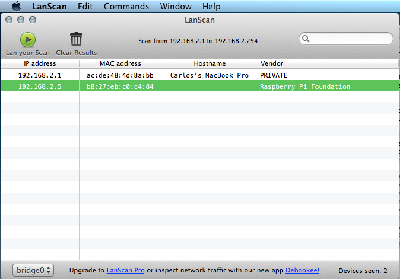
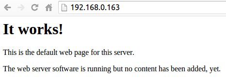
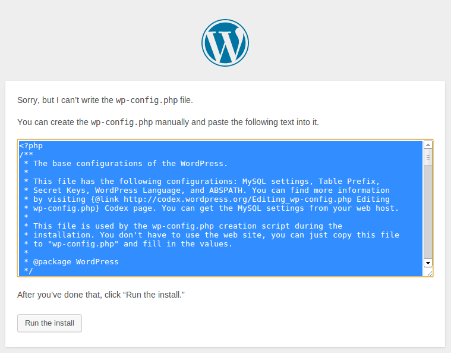
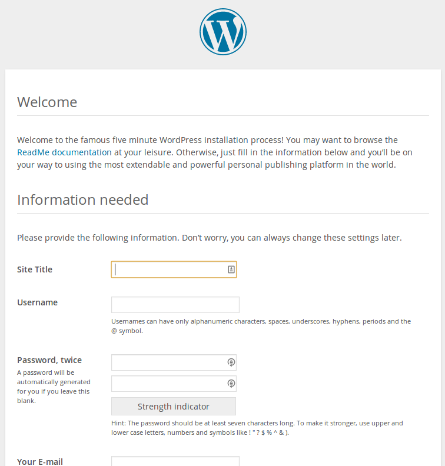

# Configuración de un servidor web en el Raspberry pi 

Configure su Raspberry pi como un servidor web y utilícelo para instalar wordpress o cualquier CMS

## Paso 1: Instalar el servidor web Apache

Apache es un servidor web de código abierto, que implementa el protocolo HTTP; es bastante popular y utilizado para alojar archivos HTML con módulos adicionales que pueden servir para la realización de páginas web dinámicas usando lenguajes como PHP. Y lo mejor de todo es que lo puedes instalar en tu Raspberry Pi.


### Instalar Apache

Primero debe instalar el paquete `apache2`por medio del comando apt-get en la terminal, teniendo en cuenta que se debe hacer desde el super usuario o root `sudo`, de esta manera:

```
sudo apt-get install apache2 -y
```

### Probar el servidor web

De manera predeterminada, Apache pone un archivo HTML de prueba en el folder web. Esta página web predeterminada se puede encontrar en el servidor cuando entras a un browser y buscas `http://localhost/` dentro del Raspberry Pi, y también se puede hacer remotamente desde otra computadora con la dirección IP del Raspberry Pi, en este caso sería `http://192.168.2.5`(acá la remplazaría con la dirección IP que le aparezca su Raspberry Pi). Para averiguar la dirección IP de su Pi, en la terminal escriba el comando `hostname -I` o si no tiene mucho conocimiento sobre la terminal y es usuario OSX le recomiendo mirar la aplicación LanScan(la cual pueden descargar desde el App store GRATIS!) y con sólo darle play puedes ver la dirección IP de tu Pi, cómo en la imágen de abajo.



Entre a la página web predeterminada, desde el Pi o desde otro computador que este en la red y usted debería ver lo siguiente:



Esto significa que esta corriendo bien Apache!

#### Cambiando la página web predeterminada

Esta página web predetermina es un archivo HTML dentro de su filesystem; y esta ubicado en `/var/www/index.html`. Entre a este directorio desde la terminal por medio del comando `cd` y después mire que hay adentro por medio del comando `ls` de esta manera:


```
cd /var/www
ls -al
```

Esto le mostrará:

```
total 12
drwxr-xr-x  2 root root 4096 Jan  8 01:29 .
drwxr-xr-x 12 root root 4096 Jan  8 01:28 ..
-rw-r--r--  1 root root  177 Jan  8 01:29 index.html
```
Esto quiere decir que existe un archivo en `/var/www/` que se llama `index.html`. El `.` se refiere al directorio en el que se encuentra `/var/www/` y los `..` se refiere al parent directory `/var/`.

#### El significado de las Columnas

1. Los permisos del archivo o los directorios
2. El número de archivos en un directorio (o `1` si es un solo archivo)
3. El usuario propietario del archivo o del directorio
4. El grupo que es dueño del archivo o el directorio
5. El tamaño del archivo
6. La última modificación, fecha y hora

Como se puede ver, el directorio `www` y el archivo `index.html` son archivos del superusuario o `root` user. Para editar el archivo, se debe tener el permiso antes de empezar a editar, esto se puede hacer de dos maneras. La primera se cambia de usuario antes de editar el archivo usando `sudo chwon pi: index.html` o también se puede con el comando `sudo` directamente `sudo nano index.html`.

Trate de editar este archivo y después darle refresh a su browser para ver los cambios en la página web.

## Paso 2: Instalar PHP

PHP es un pre-procesador; es un codigo que corre cuando el servicode recibe un pedido de una página web. Éste controla que es lo que necesita mostrar en la página, luego se la manda directamente al browser. A diferencia del HTML estático, PHP puede mostrar diferentes contenidos bajo circunstancias diferentes. Otros lenguajes son también capaces de hacer esto, pero debido a que WordPress está hecho en PHP, es el que uilizaremos. Grandes proyectos en Internet, como Facebook y Wikipedia, fueron escritos en PHP.

Instale PHP y los paquetes de Apache con los siguientes comandos:

```
sudo apt-get install php5 libapache2-mod-php5 -y
```

### Probar PHP

Ahora debe mover el archivo `index.html` a `index.php` de la siguiente manera:

```
sudo mv index.html index.php
```

Edite este archivo desde el super usuario `sudo`: 

```
sudo nano index.php
```

Ahora agregue un poco de contenido PHP en el archivo, por ejemplo el siguiente mensaje:

```
<?php echo "hello world";
```
Grabe y después hagale refresh a su browser. debería ver "hello world". Este no es un ejemplo de una página web dinámica pero es hecha en PHP. Intentemos algo dinámico, por ejemplo:

```
<?php echo date('Y-m-d H:i:s');
```
O digámole que nos muestre nuestra información de PHP:

```
<?php phpinfo();
```

## Paso 3: Instalar MySQL

MySQL es un sistema de bases de datos relacional. Como PHP, es muy popular en los servidores web. WordPress es apenas uno de los muchos proyectos que lo utiliza.

Instale el servidor MySQL y los paquetes PHP-MySQL ingresando el siguiente comando en la terminal:

```
sudo apt-get install mysql-server php5-mysql -y
```
Mientras instala MySQL, se le pedira una contraseña _root_. Deberá recordar esta contraseña para permitirle a su website ingresas luego a la base de datos.

## Paso 4: Descargar WordPress

----------------2

Puede descargar WordPress de [wordpress.org](http://wordpress.org/) utilizando el comando `wget`. Una versión actualizada de WordPress está siempre disponible en [wordpress.org/latest.tar.gz](https://wordpress.org/latest.tar.gz) y en [wordpress.org/latest.zip](https://wordpress.org/latest.zip).

Vaya a `/var/www/`, y descargue WordPress en esta ubicación. Antes de esto, deberá vaciar el contenido de esta carpeta. Cambie también las propiedasdes de usuario de esta carpeta al usuario `pi`.

```
cd /var/www
chown pi: .
rm *
wget http://wordpress.org/latest.tar.gz
```

Extraiga el paquete de archivos, mueva el contenido de la carpeta extraida (`wordpress`) al directorio actual y luego, remueva la carpeta y el paquete de archivos para finalizar:

```
tar xzf latest.tar.gz
mv wordpress/* .
rm -rf wordpress latest.tar.gz
```

Ejecutar el comando `ls` o el comando (`tree -L 1`)  en este momento le mostrará los contenidos del proyecto en WordPress:

```
.
├── index.php
├── license.txt
├── readme.html
├── wp-activate.php
├── wp-admin
├── wp-blog-header.php
├── wp-comments-post.php
├── wp-config-sample.php
├── wp-content
├── wp-cron.php
├── wp-includes
├── wp-links-opml.php
├── wp-load.php
├── wp-login.php
├── wp-mail.php
├── wp-settings.php
├── wp-signup.php
├── wp-trackback.php
└── xmlrpc.php
```

Esto es la fuente de una instalación de WorPress predeterminanda. Los archivos que usted edit para personalizar la instalación pertenecen a la carpeta `wp-content`.

## Paso 5: Set Up de una Base de Datos en WordPress

Para dejar listo su site en WordPress, necesitará una base de datos. Ejecute el comando `mysql` en la terminal y escriba sus datos de usuario (e.g. usuario `root`, contraseña `password`):

```
mysql -uroot -ppassword
```
En el anterior comando usted dio la contraseña (la palabra `password`) en la línea de comando; note que no hay un espacio entre `-p` y su contraseña.

Otra opción es escribir simplemente `-p` y esperar a que le sea pedida su contraseña:

```
mysql -uroot -p
```
Ahora se le pedirá que ingrese la contraseña de usuario _root_ que creo anteriormente.

Una vez conectado con el servidor MySQL, puede crear la base de datos que su instalación de WordPress utilizará:

```
mysql> create database wordpress;
```
Hecho correctamente, deberá ver el siguiente mensaje:

```
Query OK, 1 row affected (0.00 sec)
```
Salga del prompt de MySQL con `Ctrl + D`.

## Paso 6: Configuración de WordPress.

Necesitará averiguar la dirección IP de su Raspberry Pi en el explorador. Para esto, escriba el comando `hostname -I` en la terminal.

Vaya a `http://YOUR-IP-ADDRESS`  (e.g. `http://192.168.1.5`) en explorador de su Pi.

A continuación, deberá ver una página de error de WordPress; esto no es algo malo, es parte del proceso. Haga click en el botón de `Create a Configuration File` y luego en el botón `Let's go!` en la siguiente página.

Llene la información requerida de esta forma:

```
Database Name:      wordpress
User Name:          root
Password:           <SU CONTRASEÑA>
Database Host:      localhost
Table Prefix:       wp_
```

Si la conexión con la base de datos es exitosa, le serán dados los contenidos de su archivo `wp-config.php`:



Copie este texto, regrese a la terminal en su Pi y edite el archivo con `nano wp-config.php`. Pegue el texto en este archivo, y luego grave y ságase con `Ctrl + X`, luego `Y` para confirmar y `Enter`.

Haga click en el botón `Run the install`.

### Welcome screen

Now you're getting close.



Fill out the information: give your site a title, create a username and password, put in your email address and untick the search engines box. Hit the `Install WordPress` button, then log in using the account you just created.

Now you're logged in and have your site set up, you can see the website by visiting your IP address in the browser on the Pi or another computer on the network. To log in again (or on another computer), go to `http://YOUR-IP-ADDRESS/wp-admin`.

### Friendly permalinks

It's recommended that you change your permalink settings to make your URLs more friendly. To do this, log in to WordPress and go to the dashboard. Go to `Settings` then `Permalinks`. Select the `Post name` option and click `Save Changes`. After saving, you will be prompted to update your `.htaccess` file. You probably don't have one yet, so add one in `/var/www/` by typing `nano .htaccess`; note this is a hidden file, so it starts with a dot. Then paste in the contents provided:

```
<IfModule mod_rewrite.c>
RewriteEngine On
RewriteBase /
RewriteRule ^index\.php$ - [L]
RewriteCond %{REQUEST_FILENAME} !-f
RewriteCond %{REQUEST_FILENAME} !-d
RewriteRule . /index.php [L]
</IfModule>
```

Save the file and return to the website homepage. Click on the post title or the sample page link and you'll probably see a `Not Found` error page. This is because the `rewrite` module has not been enabled in Apache. To do this, enter `sudo a2enmod rewrite`.

You'll also need to tell the virtual host serving the site to allow requests to be overwritten. Do this by editing the virtual host file (with root permissions): `sudo nano /etc/apache2/sites-available/default`; also, change the `AllowOverride` setting on line 11 (inside the `<Directory /var/www/>` block) from `None` to `All`. Save the file and then restart Apache with `sudo service apache2 restart`. Once it's restarted, refresh the page and it should load successfully. Now posts have URLs like `/hello-world/` instead of `/?p=123`, and pages have URLs like `/sample-page/` instead of `/?page_id=2`.

### Customisation

WordPress is very customisable. By clicking your site name in the WordPress banner along the top of the page (when logged in), you'll be taken to the Dashboard. From here you can change the theme, add pages and posts, edit the menu, add plugins and lots more. This is just a taster for getting something interesting set up on the Raspberry Pi's web server.

## Licence

Unless otherwise specified, everything in this repository is covered by the following licence:


***Web Server Setup and WordPress*** by the [Raspberry Pi Foundation](http://raspberrypi.org) is licenced under a [Creative Commons Attribution 4.0 International License](http://creativecommons.org/licenses/by-sa/4.0/).

Based on a work at https://github.com/raspberrypilearning/web-server-wordpress
